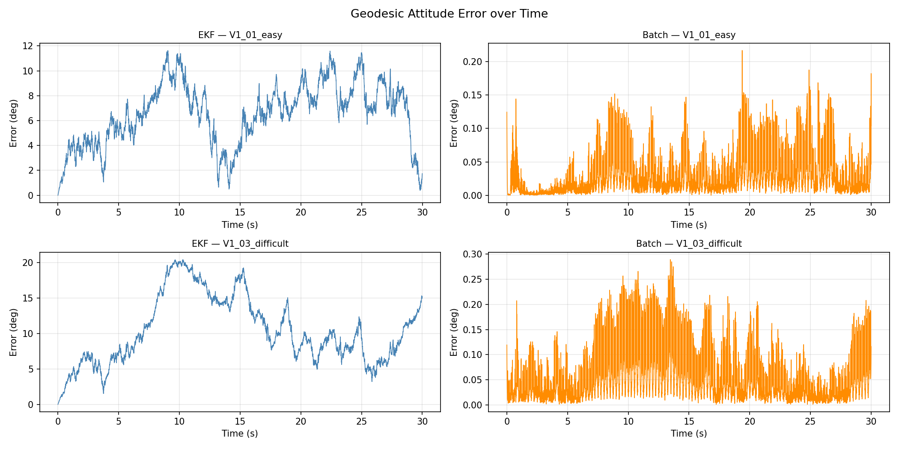
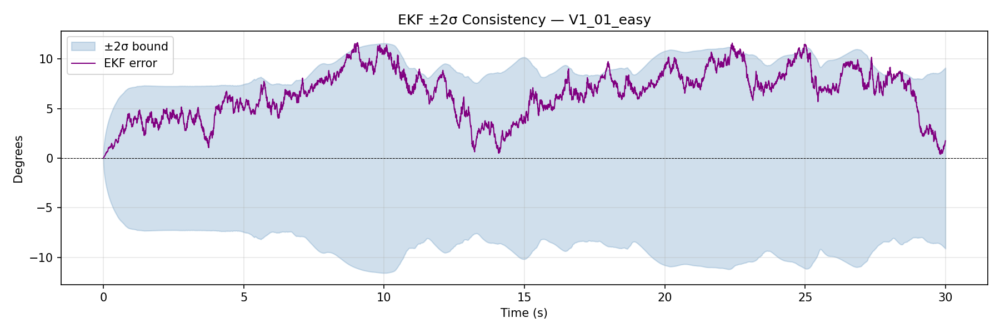
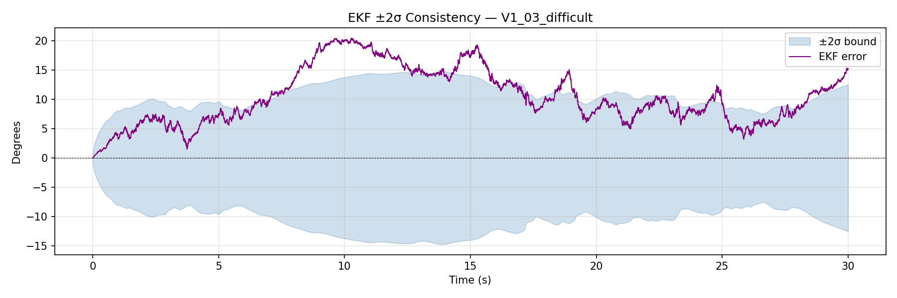
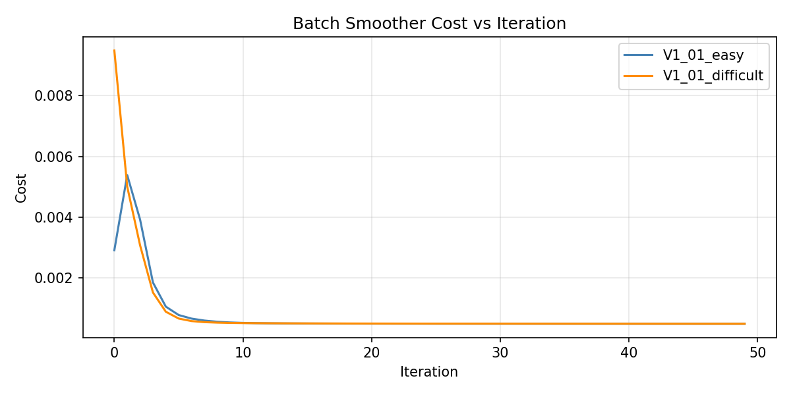
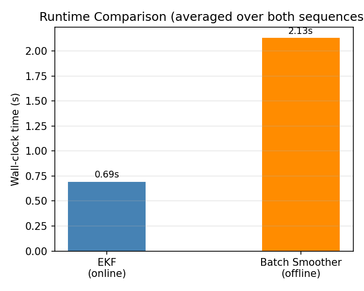

# EKF vs. Shampoo-Powered Batch Smoother for Attitude Estimation
Attitude estimation from IMU data using EKF and batch optimization on SO(3). The batch method solves a nonlinear least squares problem over gyroscope data with the Shampoo optimizer. Performance is evaluated on the EuRoC MAV dataset using geodesic attitude error.

**Course:** CS5757 Optimization Methods for Robotics, Cornell University, Spring 2026  

📄 [View Full Report (PDF)](CS_5757_State_Estimation_Project__Final.pdf)

## Results

### Geodesic Attitude Error

### EKF Covariance Consistency (easy)

### EKF Covariance Consistency (difficult)

### Convergence and runtime

### Runtime Comparison

